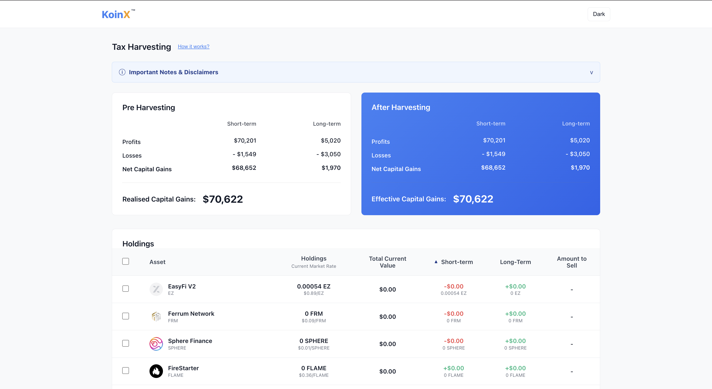
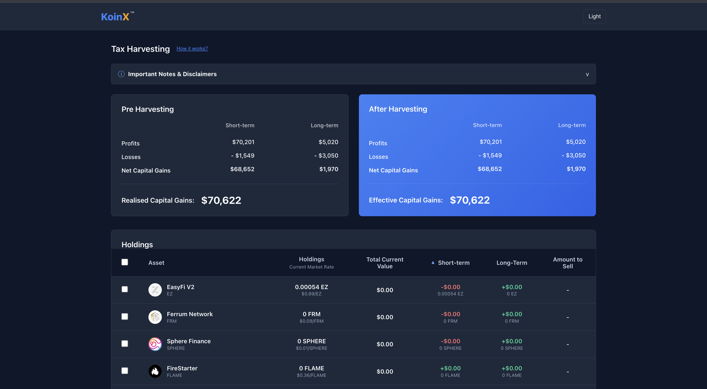
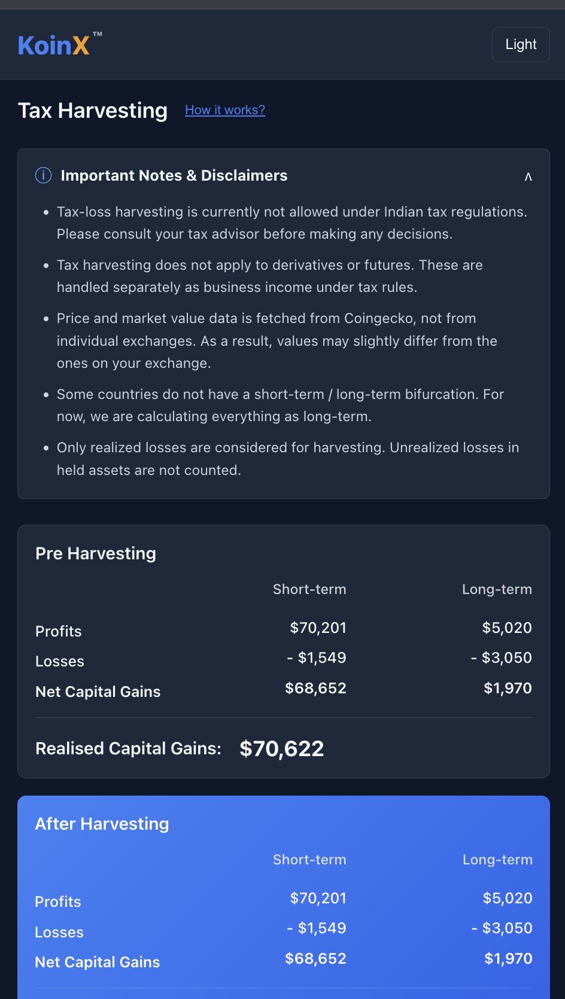

# Tax Loss Harvesting

A React web application providing a Tax Loss Harvesting interface. This tool calculates pre and post-harvesting capital gains dynamically based on user selections. It includes dynamic theme toggling (Light/Dark mode) and mobile responsiveness.

## Live Demo

[View Live App](#) 
*(https://lambent-puffpuff-91dd3c.netlify.app/)*

## Setup Instructions

1. Install dependencies:
   ```bash
   npm install
   ```
2. Start the development server:
   ```bash
   npm run dev
   ```

## Screenshots

*(Place screenshots here before submitting)*

- Desktop (Light Mode): 
- Desktop (Dark Mode): 
- Mobile Layout: 

## Architecture

- React (Vite)
- Custom Vanilla CSS
- React Context API for state management

## Assumptions & Explanations

- "Amount to Sell" defaults to mapping directly to `totalHolding` when an asset is selected.
- Mock APIs use Promise-based delays (`setTimeout`) to simulate asynchronous data fetching.
- All bonus assignment requirements (Mobile responsiveness, state management, "View All" functionality) have been implemented.
